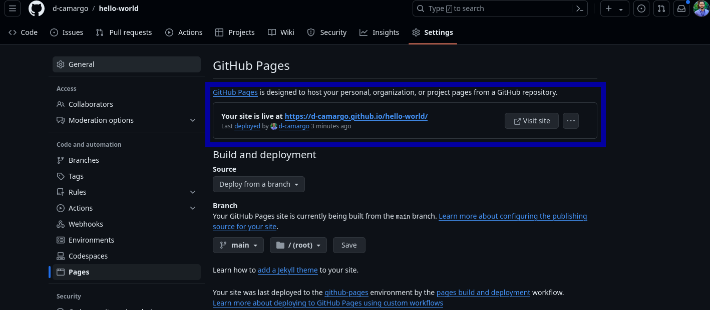

# Introdução

Quer compartilhar suas habilidades, seus pensamentos ou promover seu trabalho? Criar um site é uma ótima forma de fazer isso. 

Neste tutorial, você será guiado pelas etapas de criação de um site usando GitHub Pages. Ao final desse processo, você terá seu próprio site pronto e funcionando, exibindo suas habilidades e conquistas para o mundo!

O que é GitHub Pages?

GitHub Pages é um serviço gratuito fornecido pela GitHub que permite aos usuários criar e hospedar sites diretamente a partir de seus repositórios da GitHub.

Neste tutorial, vamos nos concentrar em criar um site básico usando GitHub Pages. Vamos abordar as etapas envolvidas na configuração do seu repositório, os ajustes do seu site e implantando o site na web!

# Por que você precisa de um site?

Como vocês puderam perceber, eu iniciei agora o meu [website](d-camargo.github.io) e nele incluí este blog. Inicialmente vou descrever por que eu acabei fazendo este site/blog e se concordarem ao final vou explicar como vocês também podem fazer um site/blog de graça (sem pagar nada!), na verdade vocês vão precisar de um tempo pra isso ("*Time is money!*").

## Por que fazer um site em 2024?

1. Ainda é uma forma de comunicação, embora atualmente estejam disponíveis várias redes sociais, o site é totalmente personalizavél e pessoal;
2. Está voltando um movimento forte dos blogs, novamente. Isso é perceptível através do próprio [LinkeIN](https://linkedin.com/) que agora tem a ferramenta de escrever artigos, contudo, há outras ferramentas existentes, como o [Medium](https://medium.com/) com uma organização bem mais atraente. De qualquer forma, o ato de expor suas ideias, criar *insights* sobre algum assunto e até mesmo ensinar através de texto tem se fortalecido;
3. Além de informações habituais (acadêmicas, experiências de trabalalho, portifólio, entre outros) é possível você criar um blog. Recentemente encontrei um canal no YouTube do [Tiago Forte](www.youtube.com/@TiagoForte) que entre vários tópicos a base é *take notes*. Pra elevar isso à um patamar mais alto, temos: 
    >"*When one person teaches, two people learn*". (Quando uma pessoa ensina, duas aprendem.)

    Aproveite, portanto, o espaço para ensinar alguma coisa, ou mesmo ensinar enquanto aprende. Nem sempre o objetivo é virar uma 'referência' em determinado assunto através de um blog, mas exercitar a capacidade de explicar ou até mesmo manter notas sobre trabalhos ou projetos que podem auxiliar você no futuro.
    
4. Ter seu prórpio site pode elevar sua perspectiva, ou seja, além do seu espaço no LinkedIN (como a maioria das outras pessoas), por exemplo, você terá outro espaço que pode auxiliar na conquista de um trabalho, aumentar o networking, ou seja, aumentar o seu valor.

## Aprendendo para ensinar
Posto meu ponto sobre o site, vou disponibilizar como você pode criar seu Website totalmente gratuíto. Vale notar que dependendo da sua familiaridade com computação isso pode ser muito fácil ou um pouco difícil. Mas inicialmente vou tentar apresentar a forma mais fácil, o que necessariamente pode não ser o site mais bonito, mas com certeza será funcional.

Outra questão importante é; não sou programador e não tenho uma graduação formal na área. Estou apenas contribuindo com a disseminação de informações que eu julgo interessantes.

# Passo 1
## Conhecendo o GitHub e criando uma conta
Você precisa de uma conta no GitHub! Então, vai lá e faça seu cadastro [GitHub.com](https://github.com/).
Há muito material disponível na rede a respeito do GitHub. Explore, leia, assista alguns materiais e depois retorne, se achar necessário.

Mas na real o que você realmente vai precisar é o que está na página do [GitHubPages](https://pages.github.com/). No link já existe um passo a passo de como fazer o site, vou tentar explicar mais detalhado e usando um tema pronto do [Jekill](https://jekyllrb.com/)

## Criando um repositório no GitHub
Os passos de criar o repositório e popular ele com um arquivo HTML e fazer o deploy no GitHub já estão na página do [GitHubPages](https://pages.github.com/). Embora esteja em inglês na maioria dos navegadores é possível traduzir a página. De qualquer forma, vamos lá.

Após o login na sua conta do GitHub você verá uma tela similar a imagem abaixo.


Sendo:

1. Local onde os repositórios ficam disponíveis para visualização;
2. Botão na cor verde "New" para abrir um novo repositório;
3. Veja que o primeiro repositório que aparece na minha lista (indicado pelo 3) é o repositório com o meu nome de usuário e com o final ``.github.io`` (domínio). Esse é o repositório que você deve criar ``seunomedeusuario.github.io``

Após clicar no botão verde, "New" você será redirecionado para a janela de criação, conforme figura abaixo.


Sendo:

1. O nome do repositório deve ser esse ``seunomedeusuario.github.io``, conforme exemplo. Veja que no meu caso o sistema está avisando que já existe um repositório com esse nome;
2. Não marque a opção do "Add a README file";
3. Clique em "Create repository".

Vou seguir utilizando um repositório de exemplo. Meu repositório chama-se 'hello-world', ou seja, o link será ``hello-world.github.io``

Feito! Agora você tem o repositório a sua disposição.

# Passo 2
## Escolhendo tema
Só falta escolher o tema que irá utilizar e criar os arquivos.


Inicialmente entre no site do [GitHub Pages](https://pages.github.com/themes/) que disponibiliza os temas existentes. Veja abaixo.


Neste exemplo vou escolher o tema "Architect". No geral, todos os temas funcionam da mesma forma.

Clique no link do tema "Architect" e você irá acessar um repositório no GitHub, conforme imagem abaixo.


No canto direto da página do repositório tem o link para acessar o site e visualizar o tema. [Pode checar aqui.](https://pages-themes.github.io/architect/)

Se rolar o mouse pra baixo, irá ver o arquivo README do tema "Architect". Logo no início vemos o item "Usage" e "Customizing" e são as informações necessárias para criar nosso arquivo ``_config.yml``. Veja na imagem abaixo.


Sendo:

1. o código que remete acesso ao tema escolhido;
2. Configurações do seu site, ou seja, qual será o título e a descrição do site.

Seu arquivo ``_config.yml`` deve conter o seguinte código:
```
remote_theme: pages-themes/architect@v0.2.0
plugins:
- jekyll-remote-theme # add this line to the plugins list if you already have one

title: [The title of your site]
description: [A short description of your site's purpose]
```
O título e a descrição do site você deverá inserir julgar melhor.

# Parte 3
## Criando arquivos no repositório

Voltando ao GitHub, a tela do seu repositório vazio deve estar dessa forma:


1. Você cria o seu arquivo dentro do GitHub;
2. Você pode fazer o upload de qualquer arquivo para o GitHub.

Vou criar um novo arquivo (opção 1) clicando em "creating a new file". O arquivo que vou criar é o ``_config.yml`` com o código que pegamos no repositório do tema. 


Perceba que o nome do arquivo deve ser iniciado por um underline '_'

Após nomear o arquivo e inserir o conteúdo, faça o "Commit changes...", botão verde à esquerda da tela. "Commit changes" mais uma vez...

### Arquivo Markdown (md)

O repositório agora tem um arquivo, o ``_config.yml``. Vamos criar mais um arquivo, o ``index.md``. O arquivo do tipo md (MarkDown) é um arquivo de texto simples que é convertido em HTML. Para ver a sintaxe de um arquivo MarkDown você pode visitar [este site.](https://www.markdownguide.org/basic-syntax/)

Se retornar a página do repositório do tema "Architect", podemos ver o arquivo ``index.md`` que é basicamente uma explicação de como funciona um arquivo md. Nesse caso temos duas opções, criar o arquivo ``index.md`` exatamente igual ao do tema ou criar um do zero.

Vou criar um arquivo igual ao do tema. Acesse o arquivo index [aqui](https://github.com/pages-themes/architect/blob/master/index.md). Vamos copiar todo o conteúdo do código desse arquivo e colar no arquivo que vamos criar no nosso repositório.


1. Clique na opção 'code' e a visualização do conteúdo irá mudar;
2. Clique na opção de 'copy raw file'. Logo após clicar uma mensagem "Copied!" irá aparecer.

Com o código armazenado vamos retornar ao nosso repositório e criar um arquivo ``index.md``, da mesma forma que criamos o ``_config.yml``.


1. Agora com o formato da janela diferente, procure pela opção "Add file";
2. Escolha a opção "+ Create new file".


Cole o conteúdo que está na memória com o atalho "ctrl+v" na área de edição e no nome do arquivo escreva ``index.md``.

# Passo 4
## Gerando a URL

Só falta "avisar" o GitHub que está tudo certo pra ele fazer o deploy e gerar o site. Pra isso, vá até a opção 'Settings'.


No painel de opções, à esquerda, encontre 'Pages'. 


Nas opções que apareceram, localize 'Branch'. Onde está ``None``, troque pela Branch ``main`` e automaticamente aparecerá outra opção com a pasta ``/(root)``. Salve a mudança.


Logo após salvar se retornar à página inicial do seu repositório você verá o status do deploy. Enquanto processa as mudanças costuma ficar um círculo laranja, conforme imagem.


Após alguns segundos pode atualizar a página (F5 do seu teclado) e voltar até a ``Settings\Pages``que o GitHub já apresentará o link do seu site.



Este é o link para o site que acabei de criar aqui com vocês [Site - Hello World!](https://d-camargo.github.io/hello-world/). Eu não fiz qualquer alteração no texto, porque não é a intenção aqui desse post, mas como esse é seu site, você deverá fazer as alterações pertinentes, como título, etc. De qualquer forma, perceba que as mudanças devem ser realizadas no arquivo ``index.md``.

É isso, qualquer dúvida só entrar em contato. Valeu!